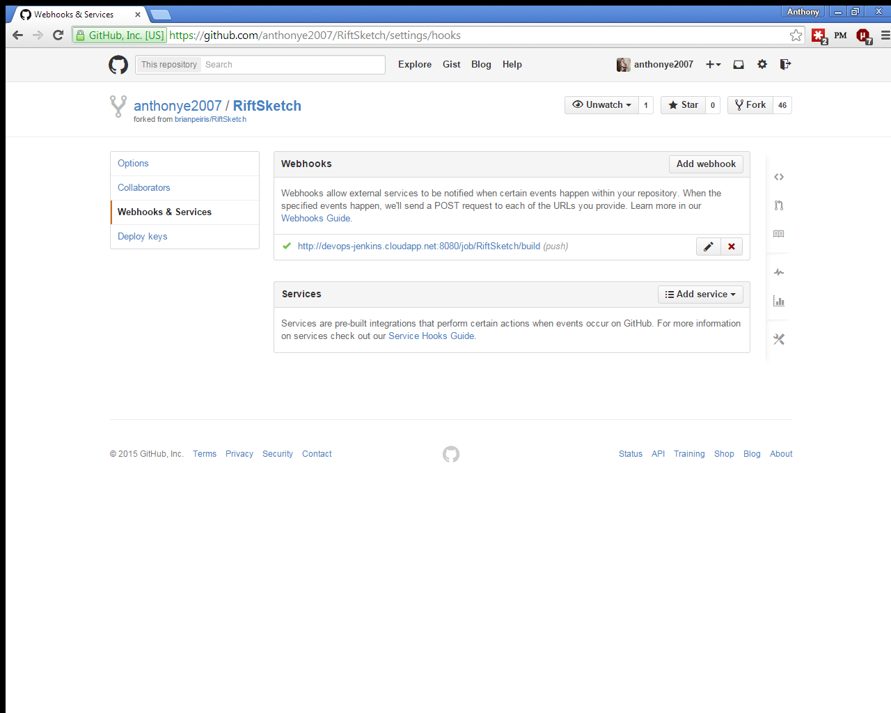
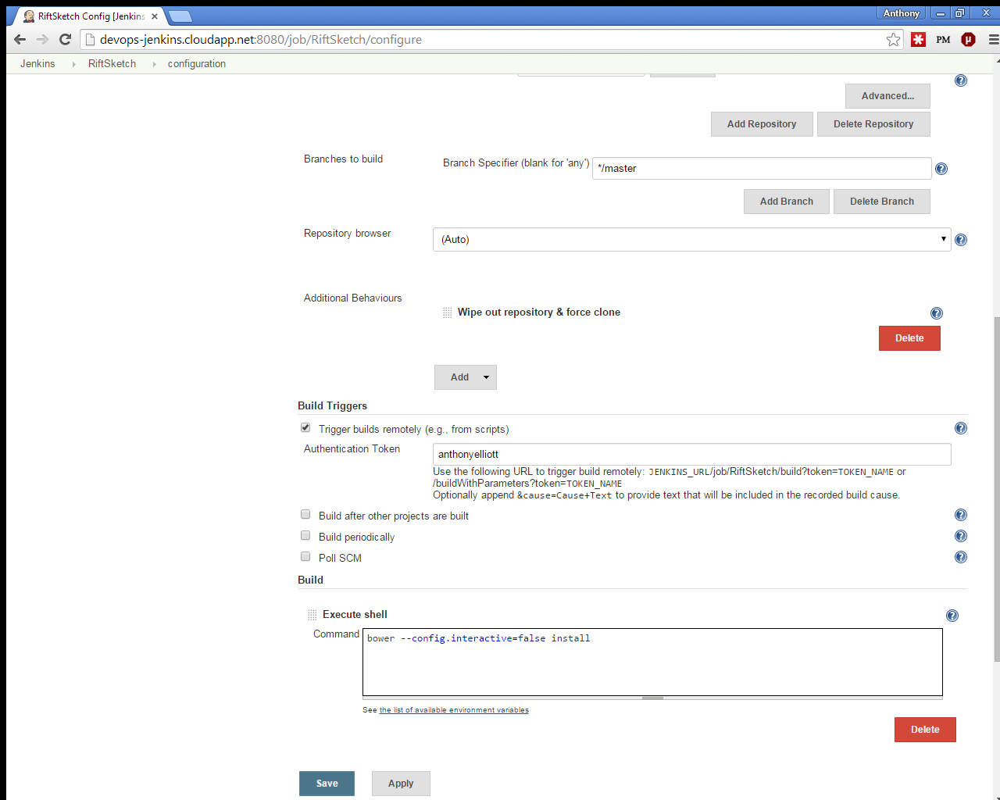
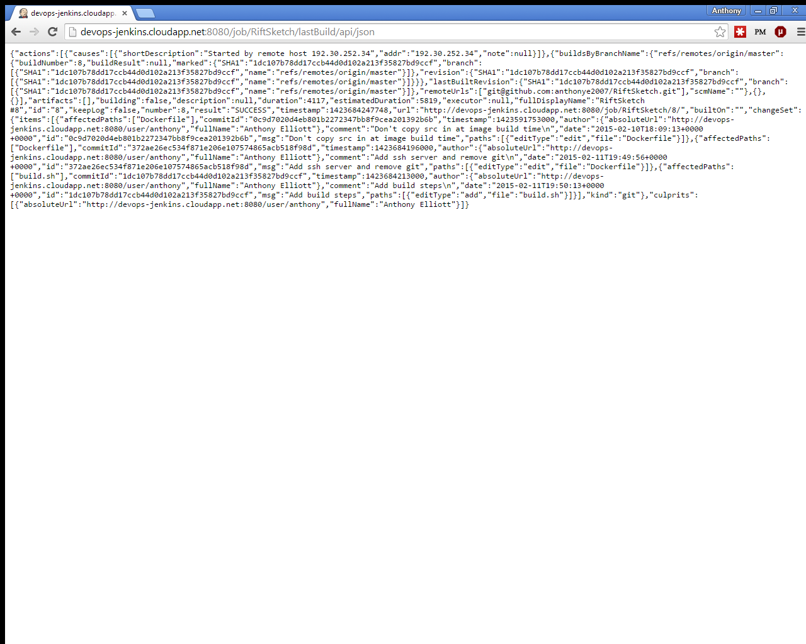
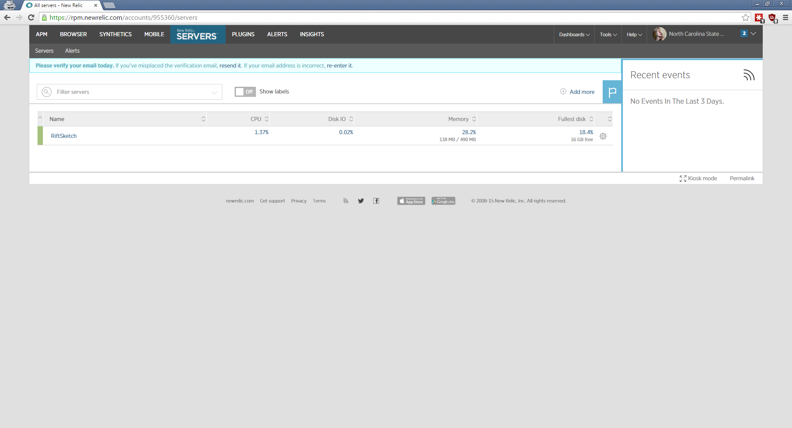

RiftSketch - DevOps
====

### Build
This is a fork of Brian Peiris' RiftSketch for DevOps class.

RiftSketch is an AngularJS webapp. I configured Jenkins for a build server.

#### Build steps

* git clone https://github.com/anthonye2007/RiftSketch.git
* npm install
* bower install
* npm test

##### Non-packaged dependencies:
* nodejs
* npm
        
npm must be installed on the target system. Then install bower using npm.
Run `bower install` at the location of the code to install dependencies.
This should create a `bower_components/` directory if successful.

#### Requirements
- The ability to trigger a build in response to a git commit via a git hook.
    + I added a webhook on GitHub and made Jenkins listen on that URL

- The ability to setup dependencies for the project and restore to a clean state.
    + I execute a shell command to run `bower install` to setup dependencies.
    + I added an 'Additional Behaviour' to wipe the repository before every build to restore to a clean state.
    

- The ability to execute a build script (e.g., shell, maven)
    + I execute a shell command to run `bower install` to setup dependencies.
    + see above screenshot
- The ability to run a build on multiple nodes (e.g. jenkins slaves, go agents, or a spawned droplet/AWS.).
    + NOT IMPLEMENTED
- The ability to retrieve the status of the build via http.
    + The status of the most recent build can be retrived by executing a GET request to `http://devops-jenkins.cloudapp.net:8080/job/RiftSketch/lastBuild/api/json`

### Test
Run `npm test` to run unit tests.
See `package.json` for the commands used to test.

NPM will first run static analysis and then the tests if the analysis passed.
A coverage report will be generated at coverage/ if the tests pass successfully.

I did not attempt to improve test coverage using one of the techniques covered in class... :(
#### Tools
The RiftSketch project uses AngularJS on the front-end, so I used Jasmine as a test framework since it integrates well with Angular.
Since RiftSketch is meant to be run in the browser, I simulate a browser using PhantomJS.
Code coverage is measured using Istanbul.
All of the testing tools are integrated using Karma, a test harness.
Finally, an npm script (`npm test`) is used to start Karma.

The build server is configured to fail the build if any of the tests fail.
See the included jenkinsConfig.xml file to verify.

### Analysis
I use JSHint for a static analysis tool, which is automatically run with `npm test`.
See `package.json` for the commands used to configure static analysis.

I extended the analysis tool to use its existing options for requiring:
  * no bitwise operators (e.g. &)
  * curly braces for all blocks, even single statement loops
  * max of 3 nested statements 

### Deploy
Every time a commit passes the build it gets uploaded to a production server.

The build server is implemented with Jenkins (see job's config file at `jenkins/RiftSketchJobConfig.xml`). After each successful build, Jenkins will tell Ansible to run a playbook that deploys to production. This file is `ansible/production.yml`.

I use NewRelic to monitor server health, specifically CPU usage, and percentage of memory used.

The production server here is a Digital Ocean droplet, accessible [here](http://104.131.26.211:8080/).

### Special
In order to properly display UI elements, RiftSketch needs to be run on a specific build of FireFox Nightly with WebVR enabled. Moreover, RiftSketch requires WebGL rendering in order to even start, which requires graphics processing. This presents a problem when teams want to run integration tests on an automated fashion.

My attempt at a solution is to use a Windows AWS instance that uses virtualized graphics cards from NVIDIA. This enables remote integration tests. Finding this AWS approach is a useful contribution, since it took me forever to figure out how I could even run WebGL on a remote server.  Additionally, once the server is running, WebGL will be disabled if using conventional methods of communication (ssh or Remote Desktop). Thus, I had to use a VNC program such as Team Viewer to even run the app since WebGL can't be transferred over the RDP protocol.

My approach was for GitHub to notify Jenkins after a developer pushed a commit. Jenkins then built the code and ran unit tests. If the unit tests passed, then Jenkins would start a specific Windows AWS instance, run the integration tests, report the results back, and stop the instance. However, configuration issues were rampant and have prevented me from finishing this.

One problem was that typical browser automation tools only work with standard versions of FireFox and are unable to parse the specific build needed. This led me to simplify my testing approach and I realized that most of my testing use cases could be covered with a simple measurement of frame rate.  If the frame rate is 0, then that means an error occurred and the app was unable to start. If the frame rate is roughly 60, then it is running fine (at least on the surface). If the frame rate is significantly below 60, then it was at least able to run, but something has changed in a bad way.

This frame rate can be measured and reported using a remote logging service such as Loggly, which is useful to see how the frame rate changes as the code changes.